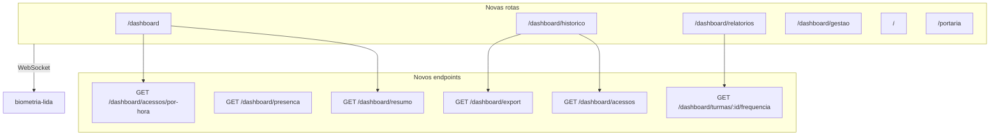
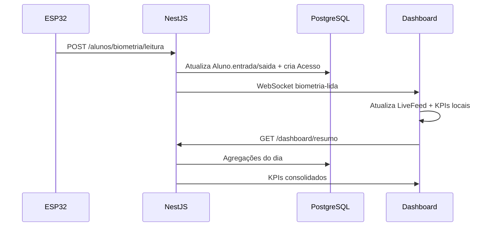

# Plano: Dashboard Completo BiometriaAFS

## Contexto atual

O projeto já tem os dados necessários, mas a interface não os aproveita:

| O que existe | Situação |
|---|---|
| [`Acesso`](backend/prisma/schema.prisma) + `Aluno.entrada/saida` | Fonte principal de métricas |
| `GET /acessos`, `GET /acessos/hoje` | Funcionam, mas retornam lista completa sem filtros |
| [`AcessosManager.jsx`](frontend/src/components/AcessosManager.jsx) + [`useAcessos.js`](frontend/src/hooks/useAcessos.js) | **Implementados, mas não conectados** ao [`App.jsx`](frontend/src/App.jsx) |
| WebSocket `biometria-lida` / `biometria-falha` | Feed ao vivo só no terminal (últimos 5, em memória) |
| Horários de aula (9 períodos) | Hardcoded só na [`extension/content.js`](extension/content.js) |
| Autenticação | Não haverá (conforme sua escolha) |



---

## Visão do dashboard ideal

### 1. Página inicial — `/dashboard`

Painel operacional do dia, foco em "o que está acontecendo agora".

**KPI cards (6):**
- Total de alunos cadastrados
- Acessos hoje (Entrada / Saída separados)
- Alunos presentes agora (`entrada` preenchido e `saida` nulo)
- Alunos que ainda não entraram hoje
- Turmas ativas (ano corrente)
- Slots biométricos em uso (X / 127)

**Widgets:**
- **Feed ao vivo** — últimos 10 acessos via WebSocket + fallback `GET /acessos/hoje`
- **Gráfico de barras** — acessos por hora (hoje)
- **Gráfico donut** — proporção Entrada vs Saída (hoje)
- **Ranking por turma** — top turmas com mais movimentação hoje

### 2. Histórico — `/dashboard/historico`

Evolução do [`AcessosManager`](frontend/src/components/AcessosManager.jsx) existente:

- Filtros: data início/fim, turma, tipo (Entrada/Saída), busca por nome/matrícula
- Paginação server-side (evitar carregar histórico inteiro)
- Edição/exclusão inline (já implementada)
- Botão **Exportar CSV** com os filtros aplicados

### 3. Relatórios — `/dashboard/relatorios`

Análise por turma e por período escolar (reutilizando a lógica da extensão Seduc):

- Seletor de turma + data
- Tabela: aluno, horário entrada, horário saída, períodos ausentes (1–9)
- Gráfico de barras: taxa de presença por turma no dia
- Gráfico de linha: tendência de acessos nos últimos 7 dias

**Horários de aula** — extrair para constante compartilhada:

```javascript
// frontend/src/constants/horariosAulas.js
export const HORARIOS_AULAS = [
  { periodo: 1, inicio: "07:20", fim: "08:10" },
  // ... períodos 2–9 (mesmos da extension)
];
```

A lógica `calcularTempos(entrada, saida, aulas)` será portada para um util `presencaPorPeriodo.js` no frontend; o backend terá equivalente em `dashboard.service.ts` para relatórios consistentes.

### 4. Gestão — `/dashboard/gestao`

Mover o painel admin atual (turmas, cadastro biométrico, tabela de alunos) para rota dedicada, sem alterar funcionalidade.

### 5. Rotas preservadas

- `/` — Terminal de frequência (inalterado em comportamento)
- `/portaria` — Tela do zelador (inalterada)

---

## Mudanças no backend

Novo módulo `dashboard` em NestJS seguindo o padrão existente (`Controllers → Services → Repositories`).

### Novos endpoints

| Endpoint | Retorno |
|---|---|
| `GET /dashboard/resumo` | `{ totalAlunos, totalTurmas, acessosHoje: { entrada, saida }, presentesAgora, naoEntraram, slotsEmUso }` |
| `GET /dashboard/presenca?turmaId=` | Lista de alunos com status: `presente`, `saiu`, `ausente` |
| `GET /dashboard/acessos/por-hora?data=YYYY-MM-DD` | `[{ hora: 7, total: 12 }, ...]` |
| `GET /dashboard/acessos` | Lista paginada com query params: `dataInicio`, `dataFim`, `turmaId`, `tipo`, `busca`, `page`, `limit` |
| `GET /dashboard/turmas/:id/frequencia?data=` | Por aluno: entrada, saída, períodos ausentes, status |
| `GET /dashboard/tendencia?dias=7` | Acessos por dia nos últimos N dias |
| `GET /dashboard/export` | CSV com mesmos filtros de `/dashboard/acessos` |

**Arquivos principais a criar:**
- [`backend/src/controllers/dashboard.controller.ts`](backend/src/controllers/dashboard.controller.ts)
- [`backend/src/services/dashboard.service.ts`](backend/src/services/dashboard.service.ts)
- [`backend/src/repositories/dashboard.repository.ts`](backend/src/repositories/dashboard.repository.ts)
- [`backend/src/constants/horarios-aulas.ts`](backend/src/constants/horarios-aulas.ts)
- Testes unitários em `dashboard.service.spec.ts`

**Queries Prisma chave** (em `dashboard.repository.ts`):
- Contagem de `Acesso` agrupada por `tipo` e data
- `Aluno` com `entrada`/`saida` para presença do dia
- `groupBy` hora via `$queryRaw` ou agregação em memória para `/por-hora`
- Paginação com `skip/take` + `count` para histórico filtrado

---

## Mudanças no frontend

### Infraestrutura

1. Adicionar `react-router-dom` e `recharts` (gráficos leves, compatível com React 19)
2. Refatorar [`App.jsx`](frontend/src/App.jsx) para usar `<BrowserRouter>` + rotas
3. Criar `DashboardLayout` — sidebar fixa com navegação entre seções, mantendo identidade visual verde (`#009245`) de [`App.css`](frontend/src/App.css)
4. Unificar HTTP: mover endpoints de acesso para [`api.js`](frontend/src/services/api.js) e corrigir `useAcessos` (hoje usa `localhost:3000` hardcoded em vez de `VITE_API_URL`)

### Estrutura de pastas proposta

```
frontend/src/
  pages/
    DashboardHome.jsx
    HistoricoPage.jsx
    RelatoriosPage.jsx
    GestaoPage.jsx
    TerminalPage.jsx
    PortariaPage.jsx
  components/dashboard/
    DashboardLayout.jsx
    KpiCard.jsx
    LiveFeed.jsx
    HourlyChart.jsx
    TipoChart.jsx
    TurmaRanking.jsx
    PeriodoTable.jsx
    TendenciaChart.jsx
    FiltrosAcesso.jsx
    ExportButton.jsx
  hooks/
    useDashboard.js      # resumo, por-hora, tendência
    useAcessos.js        # refatorado com paginação/filtros
  constants/
    horariosAulas.js
  utils/
    presencaPorPeriodo.js
    exportCsv.js
```

### Componentes reutilizados (sem reescrever)

- [`TurmasManager`](frontend/src/components/TurmasManager.jsx), [`CadastroForm`](frontend/src/components/CadastroForm.jsx), [`AlunosTable`](frontend/src/components/AlunosTable.jsx) → `GestaoPage`
- [`AcessosManager`](frontend/src/components/AcessosManager.jsx) → base do `HistoricoPage` (adicionar filtros/paginação)
- [`useWebSocket`](frontend/src/hooks/useWebSocket.js) → `LiveFeed` no dashboard
- Padrões CSS existentes: `.card`, `.section-header`, modais, tabelas

### CSS

Adicionar em `App.css` (ou `dashboard.css` importado):
- Grid de KPI cards (responsive 2×3 → 1 coluna mobile)
- Sidebar + área de conteúdo
- Estilos faltantes do `AcessosManager` (`.acessos-manager-section`, `.btn-save`)
- Estilos dos gráficos (altura fixa, cores alinhadas ao tema)

---

## Fluxo de dados do dia



---

## Ordem de implementação

### Fase 1 — Fundação (frontend)
- `react-router-dom` + rotas
- `DashboardLayout` + sidebar
- Migrar admin para `/dashboard/gestao`
- Unificar `api.js` / `useAcessos`

### Fase 2 — Backend agregado
- Módulo `dashboard` com `resumo`, `presenca`, `por-hora`, `tendencia`
- Testes unitários dos cálculos de presença por período

### Fase 3 — Dashboard home
- `useDashboard` + KPI cards + `LiveFeed` + gráficos do dia

### Fase 4 — Histórico completo
- Endpoint paginado `/dashboard/acessos`
- `HistoricoPage` com filtros + wire do `AcessosManager`
- Export CSV

### Fase 5 — Relatórios
- `/dashboard/turmas/:id/frequencia`
- `RelatoriosPage` com tabela de períodos + gráficos de turma/tendência

### Fase 6 — Polimento
- Loading/empty states, refresh automático dos KPIs (polling 30s)
- Responsividade mobile na sidebar
- Atualizar [`README.md`](README.md) com novas rotas e endpoints

---

## Fora de escopo (deliberado)

- Autenticação e perfis de usuário
- Persistência de falhas biométricas (`biometria/falha`) — permanecem só em tempo real no terminal
- PDF export (CSV é suficiente na primeira entrega)
- Migração para TypeScript no frontend

---

## Riscos e mitigações

| Risco | Mitigação |
|---|---|
| Histórico grande degradar performance | Paginação server-side desde o início |
| Duplicação da lógica de períodos (extension vs dashboard) | Constante + util compartilhados; backend espelha a mesma regra |
| `Aluno.entrada/saida` resetam diariamente | Relatórios históricos usam tabela `Acesso`, não os campos do aluno |
| Gráficos pesados no bundle | `recharts` com tree-shaking; importar só componentes usados |
